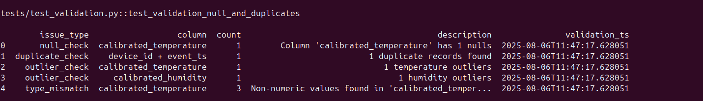
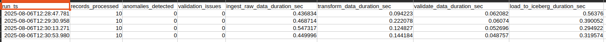

# SatSure Data Engineering Assignment

This project implements a complete IoT telemetry pipeline using Apache Airflow, MinIO, and Apache Iceberg. The pipeline ingests, transforms, validates, stores, and reports on telemetry data.

---

## 1. Environment & Airflow Setup

### Python Virtual Environment
```bash
conda create -n venv python=3.9 -y
conda activate venv
```

### Docker Cleanup & Rebuild
```bash
# Stop and clean everything
docker compose down --volumes --remove-orphans

# Rebuild Docker images
docker compose build

# Run Airflow DB init (only once)
docker compose run --rm airflow-init

# Start all services
docker compose up -d
```

### Service Access
- **Airflow Webserver**: [http://localhost:8080](http://localhost:8080)  
  Login: `admin` / `admin`
- **MinIO Console**: [http://localhost:9001](http://localhost:9001)  
  Login: `admin` / `password123`

### Verify Airflow DAG Run
1. Open Airflow UI → Locate `telemetry_pipeline`
2. Toggle ON and Trigger the DAG
3. View DAG status via **Graph** or **Tree**
4. Logs: click any task → **Log**
5. Confirm DAG run under **Browse → DAG Runs**

---

## 2. Sample Data Generation

### Generate Data Locally
```bash
python telemetry_data_generator.py
python config_data_generator.py
```
Once the scripts are executed it will generate the sample data under the ./data/raw/ folder. Upload sample data to 
MinIO for testing DAG requests

### Upload to MinIO
1. Login to MinIO (`admin` / `password123`)
2. Create bucket: `satsure-iot-data`
3. Upload local folder `data/raw/` to `satsure-iot-data/raw/`

---

## 3. Running Tests

### Inside Airflow Container
```bash
docker exec -it <airflow-webserver> bash
sudo pip install pytest moto[all] boto3
cd /opt/airflow
pytest tests/ -v
```
> Validation script may fail by design (data issues). It's kept to fail when there are null data exists in quality reports.

---

## 4. Airflow DAG Breakdown

### DAG File: `telemetry_pipeline.py`

#### Tasks:
1. **Ingestion**: Loads telemetry & config data from MinIO, avoids duplicates using checkpoints
2. **Transformation**: Applies calibration, adds aggregates, computes anomaly flag
    ```python
    merged_df["anomaly_flag"] = (
      (merged_df["calibrated_temperature"] > 45) |
      (merged_df["calibrated_temperature"] < -5) |
      (merged_df["calibrated_humidity"] < 10)
    )
    ```
3. **Validation**: Checks nulls, outliers, duplicates, type mismatches → generates CSV report
4. **Storage**:
    - Stores transformed data in Iceberg table
    - Handles schema evolution
    - Supports upserts using MERGE (Spark) or insert+delete (DuckDB)
5. **Reporting**:
    - Row counts, anomalies, timing capture via decorator help "record_task_timing"
    - Optionally includes Iceberg snapshot stats if REST/Spark is enabled

---

## 5. Local Iceberg via DuckDB (limited mode)

- **No snapshot/metadata query support**
- **Upserts** via: delete-then-insert
- **Schema evolution** supported by `ALTER TABLE ADD COLUMN`

---

## 6. Advanced Iceberg Features (via Spark + REST Catalog)

### a. Partitioning at Create Time
```sql
CREATE TABLE IF NOT EXISTS rest.iceberg.{ICEBERG_TABLE} (
  device_id STRING,
  timestamp TIMESTAMP,
  temperature DOUBLE,
  humidity DOUBLE,
  device_type STRING,
  event_date DATE,
  anomaly_flag BOOLEAN
)
PARTITIONED BY (event_date, device_type)
TBLPROPERTIES (
  'format-version'='2',
  'write.metadata.delete-after-commit.enabled'='true',
  'write.metadata.previous-versions-max'='3',
  'write.target-file-size-bytes'='512MB'
);
```

### b. Upserts with Spark
```sql
MERGE INTO rest.iceberg.{ICEBERG_TABLE} AS target
USING temp_view AS source
ON target.device_id = source.device_id AND target.timestamp = source.timestamp
WHEN MATCHED THEN UPDATE SET *
WHEN NOT MATCHED THEN INSERT *;
```

### c. Expire Snapshots
```sql
CALL rest.system.expire_snapshots(
  table => 'iceberg.{ICEBERG_TABLE}',
  older_than => TIMESTAMP '2025-01-01 00:00:00',
  retain_last => 5
);
```

### d. Compaction
```sql
CALL rest.system.rewrite_data_files(table => 'iceberg.{ICEBERG_TABLE}');
```

### e. Recommended Table Properties
```sql
TBLPROPERTIES (
  'format-version'='2',
  'write.metadata.delete-after-commit.enabled'='true',
  'write.metadata.previous-versions-max'='3',
  'write.target-file-size-bytes'='512MB'
)
```

## Monitoring and Statistics


## Quality report


---

## License & Acknowledgments

This is a technical assignment for evaluation purposes. Uses open-source tools: Apache Airflow, Iceberg, MinIO, DuckDB, Spark, and Trino.

---
